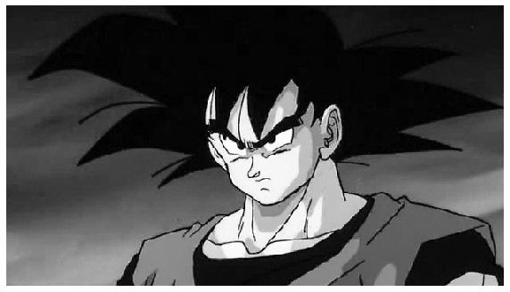
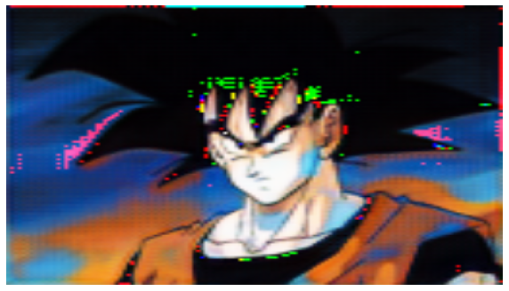
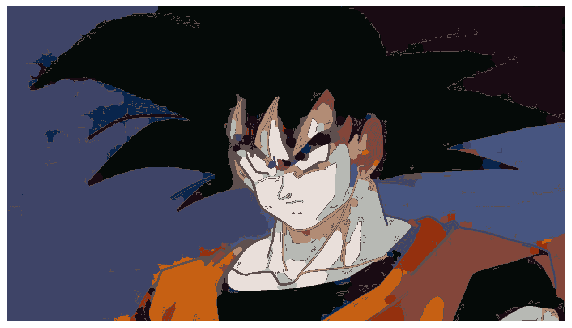
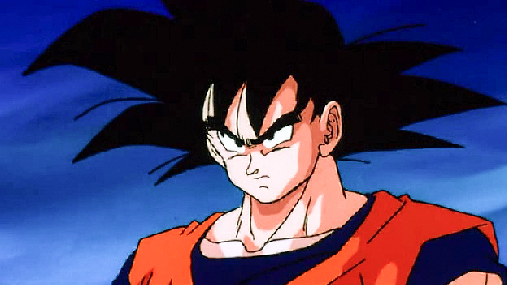

# cGan-Based-Manga-Colorization-using-1-training-image

**Currently still a work in progress**

Currently getting varying results when using just a single training image. Most manga characters arent as clean as the ones demonstrated in the paper. Works best if target Image has little to no screentones.

Paper: https://arxiv.org/pdf/1706.06918.pdf

TODO:

- [ ] ScreenTone Removal
- [ ] Reapplying Screentones/Shading
- [ ] Fix Trapped Ball Segmentation
- [ ] Test on simpler Datasets

# Current Results on Goku

### Input Image

### cGAN generated Image

### Post Processed Image

### Original Image

